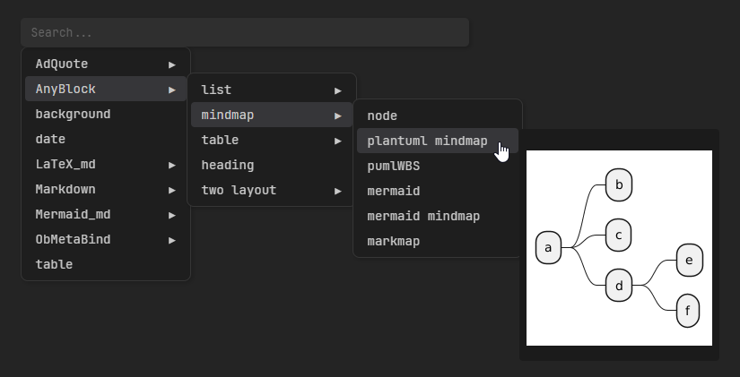

# README

 

[中文](./README.zh.md) | [English](./README.md)

## What's AnyBlock?

- A module/plugin for parsing and rendering highly versatile Markdown extensions.
  (**Obsidian plugin, Markdown-it plugin, Vuepress plugin, CodeMirror plugin, Online App**)
- Feature: You can flexibility to create a 'Block' by many means. It also provides many useful features, like `list to table` and so on
- Feature (detail): You can select a section by list/heading/table/quote/codeBlock/markdown-it-container(`:::`), and trun into table/tabs/dir/card/column/mindmap/markmap/mermaid/PlantUML/timeLine/jsonChart/nodeTree and more

## Document / More Links

- Related links：**tutorial**、use skill、contribution、secondary development、online use
- [Effects warrior/**Tutorial**](https://lincdocs.github.io/AnyBlock/README.show.html), You can learn how to use it by switching between tabs.
- [Online Interaction/Demo](https://any-block.github.io/any-block/). You can write experiences here and learn usage through templates
- [Wiki](https://lincdocs.github.io/AnyBlock/)
- Install and use
  - [Install and use in Obsidian](https://lincdocs.github.io/AnyBlock/docs/en/04.%20InstallAndUse_Obsidian.html)
  - [Install and use in Vuepress/Markdown-it](https://lincdocs.github.io/AnyBlock/docs/en/04.%20InstallAndUse_VuePress.html)
- Alternate site links：When the website link to this article fails, try replacing `linczero.github.io` with `linczero-github-io.pages.dev` in the url
- [A Min-sized version of anyblock](https://github.com/any-block/obsidian-any-block-min), you can download it manually or use the BRAT plugin to download/update the obsidian plugin automatically

## Lightspot

- Syntax free
  - No new syntax、Syntax-free intrusion
  - This also leads to no excessive reliance on plugins. I think a good plugin should not cause - when you have used the plugin for a period of time, leaving it will cause the original content to deform, become unreadable or maintainable
- Extensible
  - Facilitate secondary development
- Flexible and powerful
  - Selector (Flexible)：The selection range is flexible, with six selection methods, making it simple and easy to use
  - Processor (Powerful)：Rich and diverse, powerful in function and highly scalable
- Multi-platform, strong universality
  - It can use: **Obsidian plugin, Markdown-it plugin, Online App, Vuepress plugin**
  - Blogs such as vuepress/vitepress that support markdown-it parsing

## Effects warrior / Grammar

`multiWay table`/`multiCross table`/`Cross table`

`ListTable`/`TreeTable`/`TreeGrid`

Optimized list

The essence is "listtable" based on the addition of a mock list style

Dir Tree

The essence is "listtable" based on the addition of imitation directory style

ASCII Dir Tree

WBS (Work Breakdown Structure)

timeline

tabs & card 

mermaid flow

plantuml mindmap

nodes (ab mindmap)

markmap mindmap

mermaid mindmap

The above only shows **a few of** the processors of the plugin. In fact, it **supports a wide variety of processors and functions**. The processors can be freely combined in series, and in addition to the list selector, it also supports many other selectors such as headings, code blocks, and quote blocks. For more functions, please refer to the more detailed [documentation](https://linczero.github.io/MdNote_Public/%E4%BA%A7%E5%93%81%E6%96%87%E6%A1%A3/AnyBlock/)

## Visual editing - AnyMenu

It is recommended to use together with another plugin [AnyMenu](https://github.com/any-menu/any-menu/) developed by the author of AnyBlock, which can reduce the learning cost and quickly generate templates.

## Effects warrior - old

Here are some of the more common processors:
- list2table  (2datatable)
- list2listtable
- list2mermaid  (graph LR)
- list2mindmap  (mermaid v9.3.0 mindmap)
- list2tab
- list2timeline
- title2list + list2somthing

 

 

 

## Star History

