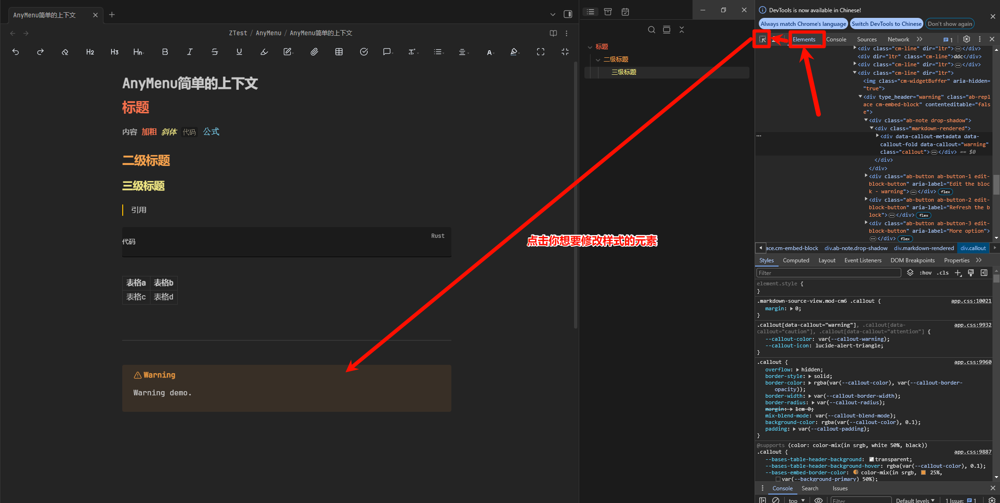
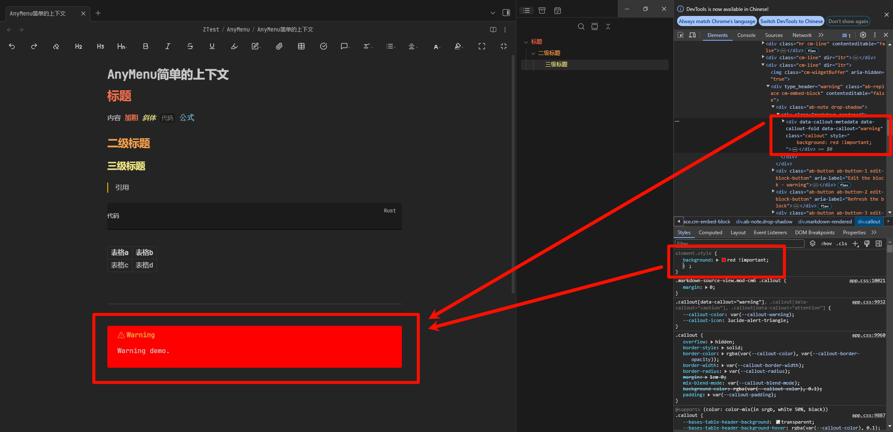
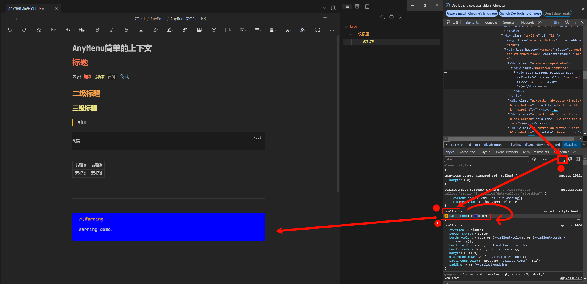

# 如何修改样式 - 疑难解决

我已经按照上一篇的内容去添加并启用了自己的自定义css，为什么没有生效？

如果你已经系统学习了 css 并知道如何使用 devTools 排查问题，就应该能自己解决这个问题

但是没关系，在推荐你去系统学习 css 之前，这里先提供一些可能能帮助你解决问题的方案

## 使用 devTools

在 Obsidian 中按下 `Ctrl + Shift + I`，你就会打开一个名叫 DevTools 的面板

然后在你可以以此选中 Element (元素) -> 通过光标选择元素 -> 点击你要修改样式的元素

就能定位到你要修改的元素对象，注意这一步不要选错元素对象哟。

## 先查看样式是否正确

如果你已经确定好了你选中的元素是正确的，且仅此元素添加自定义 css。

那么你可以在下方 Styles 最顶部的 element.style 中添加你的 css。

如果害怕被其他 css 覆盖，你可以给样式添加上一个 `!important`

如果这一步无法修改你的样式 (看不出区别)，有可能是：

- 你的 css 被覆盖了 (如果是这种情况，右下角红框对应的样式部分会出现一条删除线)，这种情况下可以加 `!important` 提升
- 你的 css 语法错误或不适用于该元素 (如果是这种情况，右下角红框对应的样式会出现一个黄色感叹号)
- 你的 css 应用了，但是这个样式不会导致元素发生变化 (你可以通过添加其他color/background等更易于观察的样式来查看是否是这种情况)
- 你选中的元素错了 (你可以看看发生变化的是否是其他元素而非你的目标元素。辅助右上角红框来排查一下是否你选中了你目标元素的父/子元素)

## 再看选择器是否正确

如果上一步成功了，你可以尝试添加带选择器的css到 devTools 中

像图中这样，先点一号红框的加号，再分别修改二号和三号红框

如果这一步无法修改你的样式，有可能是：

- 你的 css 被覆盖了 (参考上一节)，但此时不再推荐将添加 `!important` 作为首选，而应该先提升你的选择器优先度 (通过添加更多的规则)
- 你的选择器不适用于该元素 (如果是这种情况，你的二号红框会呈现灰色)，此时你应该修改你二号红框的内容，使其满足
