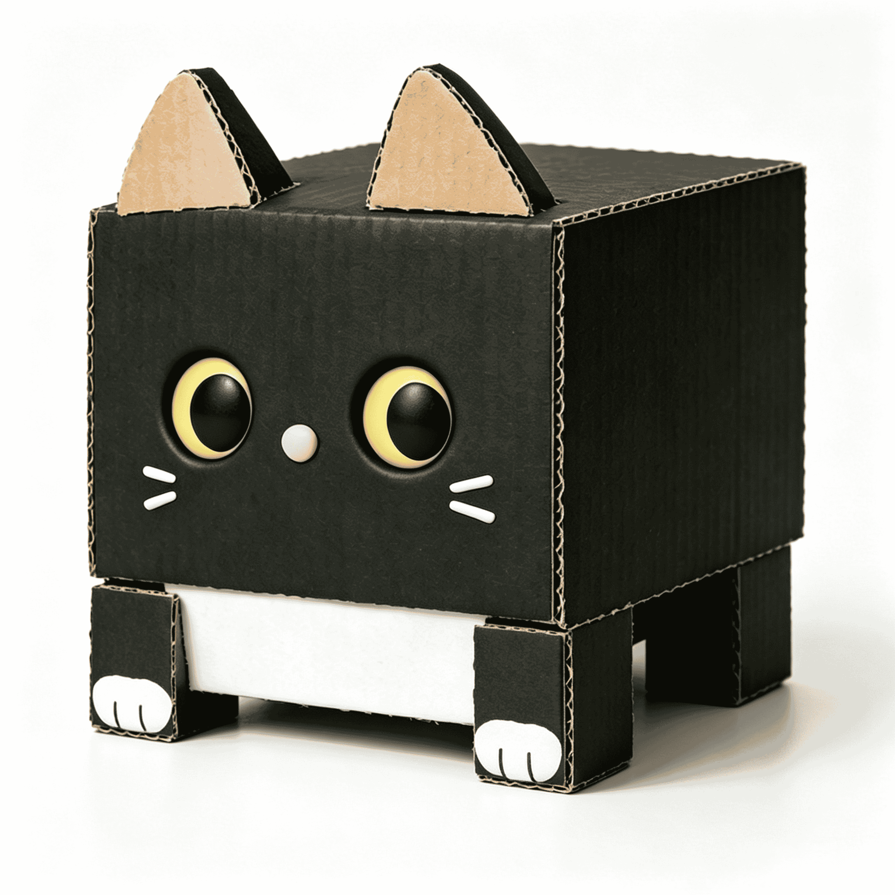

# Logo

  

## 介绍

^ 上面的这只瓦楞纸盒方块猫，就是 AnyBlock 的 Logo，兼吉祥物。

他叫作 "**瓦小楞**"，小名 "**楞楞**" / "**小楞**"

## 设计

有一天，今天看到我家的猫后，然后又想到的 “猫是流体” 以及 “方块猫” 的说法。
以及在原神中的 “绮良良” 形象，也可以变身成为 “快递猫”，千星奇域中的猫猫工坊中，也有名为 “方块猫” 的品种。

并且这种 “方块猫” 的形象与 AnyBlock 非常契合！原因：

复习一下 AnyBlock 名字的由来：

> 你可以多种方式任意选择 (Any)一个区域，将其视为块 (Block)。
> 
> 就像代码块那样。并对其进行任意操作。

AnyBlock 的 "选择区域" 又没说只能指定文本区域。那么指定一个猫，将其变成块也是很合理的吧。/doge
