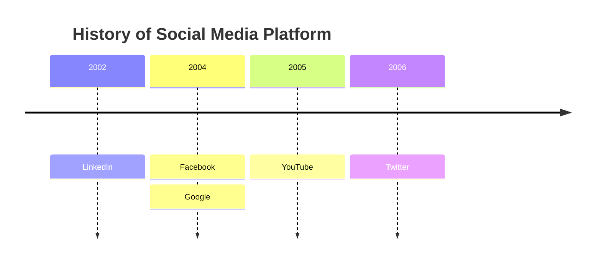
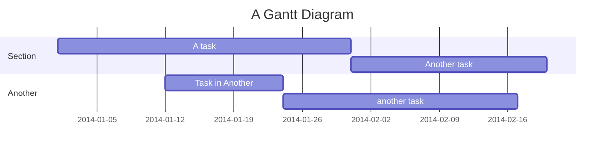

# Timeline 时间线

## Anyblock的一些时间线demo

这里列举一些更复杂的组合利用情况，最基础的用例不再赘述

### 标题选择器/mdit选择器 + tabs + timeline

标题选择器：

:::mditABDemo

[tabs]

### month1

[timeline]

- day1
  something1
- day2
  something2

### month2

2

### month3

3

:::

或mdit选择器: (效果同上，仅写法上有区别)

```md
:::tabs

@tab month1

[timeline]

- day1
  something1
- day2
  something2

@tab month2

2

@tab month3

3

:::
```

### 列表选择器 + 使用lt模拟timeline 

(这里可以用css来优化lt处理器，使其样式接近timeline)

:::mditABDemo

[list2lt|addClass(ab-table-timeline ab-table-fc)]

- month1 | df
  - day1 | 
    > [!note]+
    > fds
- month2 | sdf
- month3 | sdf
  - day1 | ff
  - day2 | sdf

:::

### timeline + timeline (嵌套)

:::mditABDemo

[timeline]

- month1
  monthly summary: xxx
  ```anyblock
  [timeline]
  - day1
    something
  - day2
    something2
  ```
- month2
  2
- month3
  3

:::

### timeline + obsidian的easy timeline插件

(注意: 这里仅会在装有 `easy timeline` 插件的 Obsidian 环境中正确生效，
否则渲染为一般的 mermaid timeline)

:::mditABDemo

[list2c2listdata|c2listdata2easytimeline]

- 2025-09-11
  Slow breakfast. Organized, felt good. Watched a space doc, had veggies and quinoa.
- 2025-09-12
  Quick jog. Worked on a project. Dinner with friends.
- 2025-10-11
  Walked, reflected. Last-minute shopping. Celebrated with friends.
- 2025-10-12
  Slept in, journaled. Walked, read. Quiet night, healthy meal, episodes.
- 2025-09-13
  Made a plan. Caught up on emails, watched snow. Tried chili, read.

:::

## 适用于Obsidian的时间线插件

- 纵向
  - AnyBlock
    上面介绍过，不再赘述
  - easy timeline
    上面也简单描述过，可以配合AnyBlock使用
  - Timeline
  - Release Timeline
    支持横向多层视图 (年月日)
- 高级甘特图
  - Markwhen (单文件)
  - Chronos Timeline (可动态缩放，AnyBlock后续可能去适配)
- ... (挺多的，可以自己在社区商店搜索关键词 `timeline`)

## mermaid/plantuml

(对于mermaid文档，如果你是中文用户，可以将域名改为 `https://mermaid.nodejs.cn/`，但会多出广告)

### mermaid timeline

https://mermaid.js.org/syntax/timeline.html



### mermaid gantt

- https://mermaid.js.org/syntax/gantt.html
- https://plantuml.com/zh/gantt-diagram



### mermaid/plantuml 时序图

这个通常不是传统的时间线，先不管

## 多轨道时间线

所谓的多轨道指的是将同一个时间段的时间线，分成多个纬度区分开，并用来分别标注。

例如：可以记录历史中，多个不同国家的工作。记录一天当中，多个不同人员的工作。或记录多个不同项目在同一段时间中的进展。

- 甘特图 (gantt)
  甘特图确实也属于这种。但mermaid基础的 gantt 图往往难以满足时间线记录者的需求。
  为此，我们可能需要更丰富更强大的高级gantt图
- 高级甘特图
  - Markwhen (Obsidian插件)
  - Chronos Timeline (Obsidian插件)
- 一个可以参考的效果: https://www.allhistory.com/staticpage/yearTable

但目前调研下来，没发现有非常好用，完全满足我需求的多轨道时间线工具！**待日后持续调研和关注**
