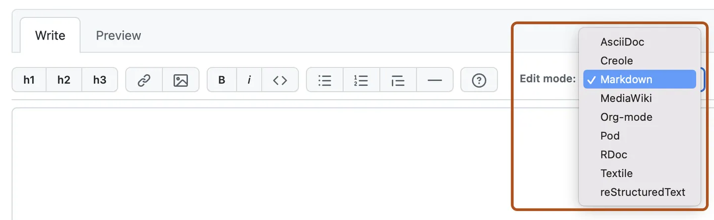

# Markdown如何合并表格?

很多人问过，我也重复回答过很多次

## 扩展位置

首先我们来看扩展类型着手点：

- 直接html语法
- vuepress插件 / 其他框架的插件
- markdown渲染引擎：markdown-it插件 / 非markdown-it体系的扩展（如remark）
- codemirror渲染引擎
- 非md语法的渲染引擎

## (1) html方案 + 在线编辑导出

不过手写html……并不推荐，写起来很费劲

通常需要配合工具便捷输入。可以用一些在线网页（可以自行搜索，不少），如 https://www.tablesgenerator.com/html_tables 。网站可以可视化编辑 (excel)，且能合并单元格，并输出markdown/html等。有的还可以把html黏贴回去继续编辑。

选用建议：

- 适合写得不频繁且不维护的。
- 一般不是很推荐，除非环境受限，或历史遗留问题很多东西不能换，不能换用框架/框架不能使用扩展

## (2) markdown-it-multimd-table / obsidian-table-extend

经典的 markdown-it 插件的表格合并单元格插件

相关链接:

- [插件的 github repo](https://github.com/redbug312/markdown-it-multimd-table)
- [插件的 npmjs](https://www.npmjs.com/package/markdown-it-multimd-table)
- [obsidian 的插件版本](https://github.com/aidenlx/table-extended)

缺点：

- 一是很久没更新了
- 二是语法非常别扭，语法设计存在问题，**完全放弃对markwon的向后兼容**。下面来吐槽几个语法：

### 一是合并表格的表示

该语法用两个紧挨着的 `|` 来表示左右合并，用 `^^` 来表示向上合并。其中一旦使用了左右合并，**该内容无法被markdown识别为表格，无插件环境下无法被渲染为表格**

```md
| 1 | 2 |
|---|---|
| a ||
| ^^||
```

应改为类型这样的语法：

```md
| 1 | 2 |
|---|---|
| a | < |
| ^ | < |
```

(如要兼容原行为，使用 `\<` 或 `\^` 就好)
(该内容在无插件环境下，依然能看出这是一个合并表格的标志，**并不损失阅读信息量**)

### 二是无表头的表示

不写表格第一行。**该内容无法被markdown识别为表格，无插件环境下无法被渲染为表格**

```md
|---|---|
| a | b |
| c | d |
```

应改为类型这样的语法：

```md
| _ | _ |
|---|---|
| a | b |
| c | d |
```

(`-` 符号可设计成其他符号。如要兼容原行为，使用 `\-` 就好)
(该内容在无插件环境下，依然能看出这是一个不写表头的表示，**并不损失阅读信息量**)

### 三是包含多行内容的表示

这个更是重量级，用 `\` 来表示多行内容。**该内容无法被markdown识别为表格，无插件环境下无法被渲染为表格**，并且还有可能以一个非常丑陋的状态显示

```md
| 1       | 2 |
|---------|---|
|```js    | a   \
|var a = 0|     \
|```      |   |
```

### 总结

我认为 markdown-it-table-extend 的语法设计相当糟糕，完全不考虑向下兼容问题。十分不推荐

并且对此，提出了许多语法设计建议。

> [!note]
> 新语法的通用性
> 
> obsidian的Sheets Extended，仓库 [obsidan-advanced-table-xt](https://github.com/NicoNekoru/obsidan-advanced-table-xt)。以及obsidian/markdown-it通用插件的 [any-block](https://github.com/any-block/any-block) 的 exTable 处理器。均使用了设计更加合理的语法，这两的语法差不多，通用的
> 
> 其中 obsidian sheets extended 更适用于只使用 obsidian 的用户，由于他们的语法相似，下面只介绍 AnyBlock 的 exTable

## (3) AnyBlock 的 exTable

使用了前文提到markdown-it-table-extend的语法改良方案，提高了兼容性

使用 `<` 和 `^` 来表示表格的合并。**简单快捷、书写性好、兼容性好、无插件状态下显示的可理解性高**

> 我认为这种语法设计算是比较优的，无插件状态下可理解性最强的。
> 语法不生效的情况下，查看者大概率能知道你想表达的意思，这就足够了
> 
> 目前采用相同语法设计的除 AnyBlock 的 exTable 外还有：
> Obsidian Sheets Extended, repo: [obsidan-advanced-table-xt](https://github.com/NicoNekoru/obsidan-advanced-table-xt) 和 Obsidian Basic Extened (前者的分支)

示例：

:::mditABDemo

[exTable]

| 1   | 2   | a   |
| --- | --- | --- |
| 3   | <   | b   |
| ^   | <   | c   |

:::

你可以不安装就能在线体验，以判断该扩展是否适合你: https://any-block.github.io/any-block/ (左上下拉框切换到 "扩展表格" 选项，即可查看对应的demo)

## (4) AnyBlock 的 list2table

使用的并非markdown表格的语法，而是markdown的列表语法，并可以通过简单的声明，将列表转换成表格。

适用于多叉表格 (并不支持左右合并，只支持树形结构的上下合并)。**简单快捷、书写性好、兼容性好、无插件状态下显示的可理解性高**

示例：

:::mditABDemo

[table]

- 1
  - 2
  - 3
    - 4
    - 5
- 6
  - 7
  - 8

:::

小技巧: 这个也可以与上一章的 exTable 合起来一起用 (AnyBlock 的串联处理器语法)

示例:

:::mditABDemo

[list2table|exTable]

- title | <| <
- 1
  - 2
  - 3
    - 4
    - 5
- 6
  - 7
  - 8
- tail
  - <
    - <

(exTable 是 el->el 处理器，需要额外适配。此处在 obsidian 中正常，但在网页端可能未能正常渲染)

:::

## (5) Markdown-it-attrs

见:

- [markdwon-it-attrs](https://github.com/arve0/markdown-it-attrs)
- Mr.Hope 大佬自己维护的版本
  - 据本人所说做了额外优化，codecov和性能上优得多，更新频率也更高些 (可能会解决原版中我下面所说的缺陷?)
  - 网站: https://mdit-plugins.github.io/attrs.html
  - repo: https://github.com/mdit-plugins/mdit-plugins/tree/main/packages/attrs

这同样是一个高通用性、高灵活性的 markdown-it 插件

其在单元格上的应用示例：

```markdown
| A                       | B   | C   | D                |
| ----------------------- | --- | --- | ---------------- |
| 1                       | 11  | 111 | 1111 {rowspan=3} |
| 2 {colspan=2 rowspan=2} | 22  | 222 | 2222             |
| 3                       | 33  | 333 | 3333             |

{border=1}
```

输出

```html
<table border="1">
  <thead>
    <tr>
      <th>A</th>
      <th>B</th>
      <th>C</th>
      <th>D</th>
    </tr>
  </thead>
  <tbody>
    <tr>
      <td>1</td>
      <td>11</td>
      <td>111</td>
      <td rowspan="3">1111</td>
    </tr>
    <tr>
      <td colspan="2" rowspan="2">2</td>
      <td>22</td>
    </tr>
    <tr>
      <td>3</td>
    </tr>
  </tbody>
</table>
```

#### 缺点

- 写起来得 “斜着写”
- 当插件失效时，不存在 “信息缺失”，但对于不知道该插件机制者，可能会造成困扰、不好理解（因为数据是“斜”的）

怎么理解这个 “斜的”

就是

```md
| A                       | B   | C   | D                |
| ----------------------- | --- | --- | ---------------- |
| 1                       | 11  | 111 | 1111 {rowspan=3} |
| 2 {colspan=2 rowspan=2} | 22  | 222 | 2222             |
| 3                       | 33  | 333 | 3333             |

会变成

| A   | B   | C   | D    |
| --- | --- | --- | ---- |
| 1   | 11  | 111 | 1111 |
| 2   | <   | 22  | ^    |
| ^   | <   | 3   | ^    |
```

或者反过来理解

```md
如果你希望得到以下结果：

| A   | B   | C   | D    |
| --- | --- | --- | ---- |
| 1   | 11  | 111 | 1111 |
| 2   | <   | 222 | ^    |
| ^   | <   | 333 | ^    |

那么你应该写成：

| A                       | B   | C   | D                |
| ----------------------- | --- | --- | ---------------- |
| 1                       | 11  | 111 | 1111 {rowspan=3} |
| 2 {colspan=2 rowspan=2} | 222 | _   | _                |
| 333                     | _   | _   | _                |
```

“斜着写” 会造成的具体缺点：

- 插件失效时，别人使用其他markdown查看器 (如github/obsidian/typora等) 
  来查看方式来查看该md时，容易造成混乱
- 自己在没有对应的专用可视化编辑器环境时，也提高了书写和维护成本
  （每次编辑对要找对齐一下，脑内渲染）

#### 个人修改建议

（仅代表我个人使用习惯所产生的观点）

```md
如果你希望得到以下结果：

| A   | B   | C   | D    |
| --- | --- | --- | ---- |
| 1   | 11  | 111 | 1111 |
| 2   | <   | 222 | ^    |
| ^   | <   | 333 | ^    |

那么应该写成：

| A                       | B   | C   | D                |
| ----------------------- | --- | --- | ---------------- |
| 1                       | 11  | 111 | 1111 {rowspan=3} |
| 2 {colspan=2 rowspan=2} | _   | 222 | _                |
| _                       | _   | 333 | _                |
```

这里又分两种实现策略：

- 一是可以借用特殊符号 (如我这里的 `_`) 来表示该 `td` 不应被渲染，这样可以很好地对齐。
  - 当然，也可以使用 markdown-it-attrs 的通用语法，直接用 `{.none}` 之类的设置td不显示，也可以很好地做到对齐。上一种方法可看作是这种语法的语法糖。
  - 该方案遵循了原来的语法设计，可以不额外添加新语法（但目前这样用是不行的，因为和表格额外的冗余单元格自动删除逻辑冲突了。渲染结果会把超出表格部分的单元格给删掉，该过程不受到你display:none单元格的影响）
  - 缺点是对用户的写作规范性有要求 (不过原来的写法也有写作规范性要求，要求还更高)
- 二是自动判断
  - 无论被覆盖内容是什么，都能做到自动判断该格被 `colspan/rowspan` 属性覆盖

## (6) 非Markdown方案 (md超集)

如果你不想使用 md 超集，该节内容也值得一看，可以参考其语法设计等


[table]

- .md
  - CommonMark
    - https://spec.commonmark.org/0.31.2/
  - GFM
    (Github Flavored Markdown, Github风格Md)
    - https://github.github.com/gfm/ 或 https://gfm.docschina.org/zh-hans/ (19年标准)
  - OFM
    (Obsidian Flavored Markdown, Obsidian风格Md)
    - https://help.obsidian.md/obsidian-flavored-markdown
  - Kramdown
    - https://kramdown.gettalong.org/
      有点像md + markdown-it-attrs 风格
- 非.md的类md
  - .mdx
    - https://mdxjs.com/
      md + 组件，追求功能性。将 markdown 和 JSX 语法完美地融合在一起
  - .adoc
    - https://asciidoc.org/
    - Github支持识别渲染，全名 AsciiDoc
  - .rst
    - reStructuredText，常用于Python社区
    - Github支持识别渲染
  - .qd
    - quarkdown
  - .qmd
    - Quarto
  - .mdz
    - https://www.bilibili.com/video/BV1PZ7hzdEUD
  - MediaWiki
    - [语法-整理](https://dapeng.li/learning/mediawiki/)
    - [语法](https://www.mediawiki.org/wiki/Help:Formatting/zh)
    - [语法-表格](https://www.mediawiki.org/wiki/Help:Tables)
    - Github支持识别渲染
  - Wikipedia
    - Wikipedia 的 Pipe 语法
    - 语法和功能性都很接近html，只比html简化一点。所以得到了强大的功能和难写的语法
    - [语法](https://zh.wikipedia.org/wiki/Help:%E7%9B%AE%E5%BD%95)
      [语法-表格](https://zh.wikipedia.org/wiki/Help:%E8%A1%A8%E6%A0%BC)
- Json类
  - .ipynb
- LaTeX类
  - .tex
    - LaTeX
  - .typ
    - Typst
- 富文本
  - .docx
- 不知道 (未验证)
  - .org
    - Org-mode，主要用于Emacs用户，支持笔记和任务管理
      Github可能支持渲染?
  - .textile
    - 轻量标记语言
  - 其他
    - .rdoc .pod .creole .mediawiki

### (Github支持的)

在Github仓库中编辑Wiki可以看到 Github 所支持的格式:

- AsciiDoc
- Creole
- Markdown
- MediaWiki
- Org-mode
- Pod
- RDoc
- Textile
- reStructuredText



### Kramdown (.md)

这个和 md + markdown-it-attrs 是很像的，可以看前面的 Markdown-it-attrs 一节和 Kramdown 官网

此处不再赘述，感觉不如 md + markdown-it-attrs 灵活

### AsciiDoc (.adoc)

这个github自身支持这种形式的渲染，如果完全针对于在github上的文档可以用这个

(反正我不建议，我个人肯定不希望看文档时有那么多奇怪的格式。
特别是不向下兼容的格式、以及看源码难以推测其想要表示的内容的格式)

介绍三个代表性的表格扩展语法:

参考: [AsciiDoc 表格教學](https://roulesophy.github.io/AsciiDoc-%E8%A1%A8%E6%A0%BC%E6%95%99%E5%AD%B8/)

**多行内容**

```md
|===
|header 1 |header 2 |header 3
|info 1 a|info 2

* item 1
* item 2
|info 3
|info 4 |info 5 |info 6
|===
```

**嵌套表格**

```md
[cols=",,"]
|===
|info 1
a|info 2
[cols=","]
!===
!inside 1 !inside 2
!inside 3 !inside 4
!===
|info 3
|info 4 |info 5 |info 6
|===
```

**合并单元格**

|Example | 	說明 |
|--------|-------|
|2+ 	   | 這個儲存格佔了兩欄 |
|.2+ 	   | 這個儲存格佔了兩列 |
|2.3+ 	 | 這個儲存格佔了兩欄和三列 |

```md
[cols=",,,"]
|===
|info 1 |info 2 |info 3 |info 4
.3+|info 5 |info 6 2.2+|info 7          
|info 8
2+|info 9 |info 10
|===

或

[cols=",,,"]
|===
   |info 1    |info 2      |info 3    |info 4
.3+|info 5    |info 6  2.2+|info 7          
              |info 8
            2+|info 9                 |info 10
|===
```

### mdxjs (.mdx)

这个没什么好说的，本质上是 "Markdown + 组件"。组件你想写啥都行，写个合并表格自然不在话下

- 优点是强大，功能性无所不能
- 缺点是对环境要求更高，一个简单的md解析和渲染库无法满足其解析渲染要求，还需要一些额外的环境。
  这对于通用性和标准铺设来说是灾难性的，仅适合在特定场景中使用

### Wikipedia Pipe / MediaWiki

参考: https://zh.wikipedia.org/wiki/Help:%E8%A1%A8%E6%A0%BC#Pipe%E8%AF%AD%E6%B3%95%E6%95%99%E7%A8%8B

Wikipedia (维基百科) 的和MediaWiki这两差不多，表格都是这种 `{|...|}` 的形式，这里介绍 Wikipedia 的:

举例一些语法:

**合并单元格**

```md
{| class="wikitable"
|-
! 栏目一 !! 栏目二 !! 栏目三
|-
| rowspan="2" | A
| colspan="2" style="text-align: center" | B
|-
| C
| D
|-
| colspan="2" style="text-align: center" | E
| F
|- 
| rowspan="3" | G
| H
| I
|- 
| J
| K
|-
| colspan="2" style="text-align: center" | L
|}
```

将有这样的效果：

[exTable]

|栏目一 |	栏目二 | 栏目三 |
|------|--------|-------|
| A    | B      | <     |
| ^    | C      | D     |
| E    | <      | F     |
| G    | H      | I     |
| ^    | J      | K     |
| ^    | L      | <     |

**嵌套表格**

```md
{| class="wikitable"
| 原有
|
{| style="background: blue; color: white" class="wikitable"
| 插入
|-
| 表格
|}
| 表格
|}
```
